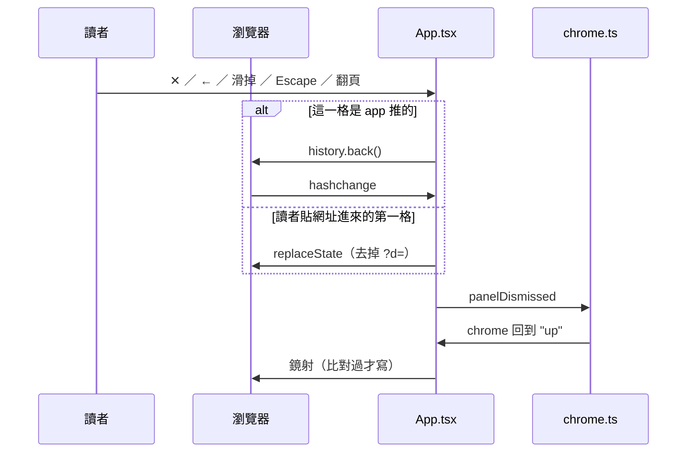

# 疊上來的東西共用一個殼，而且一律進網址

日期：2026-08-31。

## 決定

閱讀器上疊得出來的面有四張：〈目錄〉〈筆記〉〈排版〉，以及從書架或書裡都開得到的〈書的詳情〉。

**三件事一起定下來：**

1. **四張面共用一個元件**（`components/Panel.tsx`）。原本有兩個殼，另一個叫〈抽屜〉，
   **這個詞刪掉**。介面上疊出來的東西只剩〈畫面 / Screen〉與〈面板 / Panel〉兩種。
2. **四張面的差別收成一顆 prop，`needs`**，答的是「這張面開著的時候，底下那個東西還有沒有
   事情要做」。三個值：`"page"`、`"book"`、`"nothing"`。
3. **四張面一律進網址**（`?d=`），不分寬度、不分哪一張。所以 Android 的返回鍵在四張面上行為
   一致，重整之後面還在。

## 為什麼

### 兩個殼本來就是同一份程式碼

`Panel.tsx` 與 `Drawer.tsx` 的 props 完全一樣（`open` / `onClose` / `title` / `testId` /
`children`），內容都是 `BaseDrawer.Root → Portal → Backdrop → Viewport → Popup → header +
Title + Close ✕ → body`。連 ✕ 的 i18n 註解都已經是共用的一條，寫著它「dismisses a drawer or
a panel」。那條註解等於先招認了。

差別只有四項：portal 到哪、`modal` 是什麼、滑掉的方向、以及關閉的例外。

而且 #147 之後，**窄畫面上兩者連長相都一樣了**。〈書的詳情〉的寬度是 `min(26rem, 100%)`，
26rem 是 416px，任何一支手機都比它窄，所以它在手機上早就是全螢幕；#147 讓〈目錄〉與〈筆記〉
也是。兩塊長得一模一樣，返回鍵卻只關得掉其中一個，另一個會關掉整個 app。

### 桌機上的七項差別，背後只有一個問題

桌機上兩者確實不一樣（裝在哪個盒子裡、上下 bar 蓋不蓋得住、背景暗不暗、trap 不 trap、書會不會
重新分頁、紙的階、寬度），但那**不是七個決定，是同一個決定的七個後果**。那個決定是：

> **這張面開著的時候，底下那個東西還有沒有事情要做？**

| 面 | 底下還有沒有事情要做 | `needs` |
| --- | --- | --- |
| 〈排版〉 | 有，而且最強：讀者正在調的就是底下那一頁，蓋住它等於蓋住答案（[ADR-0005](0005-the-reader-adjusts-their-own-reading-not-this-book.md)） | `"page"` |
| 〈目錄〉〈筆記〉 | 寬畫面有：按下章節之後面板要留著，因為它送你去的地方就在旁邊。窄畫面沒有：沒有欄可以讓，留一條書縫換不到東西 | `"book"` |
| 〈書的詳情〉 | 永遠沒有：讀者看三個數字然後離開，而且它講的是**某一本書**，底下那個畫面不一定是那本書 | `"nothing"` |

⚠️ **這顆 prop 說的是「我需要底下的什麼」，不是「我錨在哪一邊」。** 錨在哪一邊會隨視窗寬度變，
寫成 prop 就是 JavaScript 在決定版面，而那件事是禁止的（`lib/media.ts`：版面等 JavaScript 的話，
進場第一幀會閃錯的排法）。**CSS 拿 `needs` 配上寬度決定長相，JavaScript 拿同一組決定行為**，
兩邊各推導各的。

推導出來的完整結果：

| `needs` | 桌機（≥820px） | 手機（<820px） |
| --- | --- | --- |
| `"page"` | 右邊一欄，sunken，不變暗，不 trap，✕，往右滑 | 底部 sheet、書留在上面，raised，不 trap，←，往下滑 |
| `"book"` | 右邊一欄，sunken，不變暗，不 trap，✕，往右滑 | 全螢幕，raised，trap，←，往下滑 |
| `"nothing"` | 蓋在整個視窗上，raised，**變暗**，trap，✕，往右滑 | 全螢幕，raised，trap，←，往下滑 |

**trap focus 與捲動鎖是同一個條件**：這張面有沒有蓋住整個畫面。兩件事其實是同一個主張：一個
拿走讀者全部注意力的面，背後不該還有東西在回應鍵盤或還在捲動。

### 為什麼〈書的詳情〉維持 `"nothing"`

`"nothing"` 不是為它保留的特例，它是三個合法答案之一，而且**手機上的目錄與筆記走的就是這個
答案**。所以沒有為了它多寫任何一行條件。

把它改成 `"book"` 的話有兩筆帳是真的重：**書架上沒有「一欄」這個東西**（`.library` 是
`width: fit-content` 置中的），以及**按一下「關於」書就會重新分頁**（frond 靠 `ResizeObserver`
重排，而〈書的詳情〉不需要書在旁邊，付了拿不到東西）。

## 網址與返回鍵

五種寫法，一次只有一個：

```
?d=toc/<bookId>
?d=notes/<bookId>
?d=notes/<bookId>/<noteId>
?d=layout/<bookId>
?d=about/<bookId>
```

⚠️ **`?d=` 放得下一個值，所以四張面互斥。** 在桌機上開「關於」會關掉站著的面板，那不是特別寫的
規則，是這個結構的結果。

⚠️ **筆記要兩層。** 讀者是分兩步走進來的（開筆記 → 點某一筆），退出去也該分兩步。在書上點一條重點
會直接進第二層，那時候按返回鍵要回到書，不是回到一個讀者沒經過的列表。

⚠️ **書上亮著的那段字（`chrome.ts` 的 `selected`）不進網址。** 它的定義是「活到讀者離開這一頁
為止」，而重整就是離開。另外網址裡已經有兩種指某一段文字的寫法（`?at=` 與 `?select=`），第三種
只會讓三者的差別變成下一個人要查的東西。

### 什麼時候推歷史：只看層數

要守的是一句話：**按瀏覽器的上一頁，退回結構上的上一層。**

| 層 | 讀者看到什麼 | 網址 |
| --- | --- | --- |
| 0 | 書（或書架） | `#/book/<bookId>` |
| 1 | 疊著一張面 | `?d=toc/…`、`?d=notes/…`、`?d=layout/…`、`?d=about/…` |
| 2 | 筆記面板裡打開了某一筆 | `?d=notes/<bookId>/<noteId>` |

| 層數 | 網址怎麼寫 | 什麼時候 |
| --- | --- | --- |
| 變深 | push 一格，**跳幾層都只推一格** | 開一張面（0→1）、點列表裡的一筆（1→2）、在書上點一條重點直接進編輯（0→2） |
| 不變 | `replaceState` | 目錄換成筆記：同一層換一張，不是多一層 |
| 變淺 | 退回**放著那個目的地的那一格** | ✕ ／ ← ／ 滑掉 ／ Escape，以及翻頁、點章節、選取文字把面板收掉 |

⚠️ **「變淺」不等於「退一格」，因為層數跟格數不是同一個數。** 0→1→2 推了兩格，0→2 只推一格，而
一個 ✕ 按在打開的筆記上會**一次清掉兩層**。那時候只退一格會落在筆記列表那一格上，然後「網址 →
狀態」那一支照著它把列表又叫回螢幕上，讀者得按第二次 ✕。所以每一格推的時候都記下**它是疊在哪一張
面上的**（`behind`），退的時候就照那個瞄準，而不是拿層數去算格數。三條路都走得到：

| 底下那一格放的是 | 怎麼退 | 例 |
| --- | --- | --- |
| 正好是要去的地方 | 退一格 | 目錄開著按 ✕ |
| 一張面，而要去的是光禿禿的畫面 | 退兩格 | 筆記 → 某一筆 → ✕ |
| 都不是 | 改寫這一格 | 筆記編輯開著的時候按〈目錄〉。歷史裡沒有任何一格放著〈目錄〉，退過去只會落在別的東西上 |

⚠️ **退回去只收回面板那一層，不收回底下那個畫面。** `replaceAt`（在〈筆記〉裡按引文之後，把讀者
現在那一頁寫進網址用的）寫的就是面板站著的那一格，而窄畫面上按引文會同時把面板關掉，於是退回去
的那一格是面板打開**之前**的，上面沒有那個 `?at=`。所以退之前先把畫面那一半留著，等新網址回來再
`replaceState` 寫回去，不然讀者正看著那一段，網址卻已經忘了它。

**為什麼用層數，不是一個事件配一條規則？** `chrome.ts` 有 11 種事件，其中**八種都可能讓面板
消失**（翻頁、點章節、選取文字、點書上的重點……），一個事件一條規則就是八條散在八個地方。那正是那支
檔案檔頭警告過的舊坑：面板狀態以前散在 11 個 `setChrome` 呼叫裡，出過 bug 才收成一支純函式。
歷史這一層不要再犯一次。所以**「讀者現在有多深」只有一個地方回答**（`App.tsx` 的 `showPanel`），
它問的是層數變深、不變、還是變淺。

⚠️ 旁邊還有兩支會動到網址，而且它們都不是在講面板：`go` 是換畫面，`replaceAt` 是把讀者現在
站的那一頁寫進網址。**`replaceAt` 要把那一格自己的 state 原樣帶過去**：`showPanel` 推格子時
做的記號就在上面，而 `replaceAt` 有可能在面板站著的時候跑（在〈筆記〉裡按引文會跳到那一段，
寬畫面上面板不關）。寫成 `null` 就等於把記號從一個確實是我們推的格子上刮掉，接下來按 ✕ 就會留下死歷史。

**為什麼變淺是退回去，不是就地改網址？** JavaScript 沒有「刪掉一格歷史」這個 API。就地改
（`replaceState`）會留下一格跟前一格長得一樣的死歷史，讀者按上一頁會覺得沒反應，要按兩次才
離開這本書；改成往前加一格（`pushState`）則是按下一頁會把面板叫回來。

⚠️ **一個例外：這一格不是 app 推的時候，變淺要改用 `replaceState`。** 讀者直接把
`?d=notes/<bookId>` 貼進新分頁的話，那一格是分頁的第一格，`history.back()` 沒有東西可以退，
於是網址不變、`hashchange` 不發生、狀態機收不到通知，**面板會卡在畫面上，← 按幾次都一樣**。
而且它壞得很安靜：測試只要都是「先開書再開面板」就永遠踩不到。push 的時候做記號
（`history.pushState({ panel: true }, …)`），關的時候看記號決定走哪條。這一格前面沒有重複的
一格，所以在這裡用 `replaceState` 不會留下死歷史。

### 真相來源是狀態機，網址是它的鏡子



返回鍵造成的 `hashchange` 不直接改狀態，而是翻譯成既有的 `panelDismissed` 事件餵回狀態機；
開頁時反向跑一次，從網址算出 chrome 的初始值。**不必新開 `backPressed` 之類的事件**：面板消失
就是面板消失，不管讀者是怎麼要求的。

⚠️ **鏡子寫之前一定要先比對**，不然會繞成無窮迴圈。而且兩個方向不能同時說話：`Reader.tsx` 的
「狀態 → 網址」那一支在網址剛動過的那一輪要讓開，否則 React 先跑它、它看到還沒更新的狀態、
就會把剛退掉的那一格再推回去，返回鍵於是完全沒有反應。這條在實作時真的踩到了，
`tests/browser/reader/panel-address.spec.ts` 裡每一條按返回鍵的案例都紅過一次。

⚠️ **`history.back()` 是非同步的**：畫面要等瀏覽器把 `hashchange` 丟回來才反應，所以面板會比
以前多留一幀左右才收掉。這是「關閉＝退回去」換來的，接受。

⚠️ **而且在那一幀之內，鏡子不可以再開口。** 讀者按一下，chrome 常常動兩次：面板開著的時候按
翻頁鈕，那一下同時是「按到面板外面」與「翻一頁」，所以 chrome 走的是 `notes → up → down`，
兩個 commit。網址還沒回來之前這兩次都看到「狀態跟網址不合」，於是各要一次 `back()`，一下按鍵
退兩格，讀者從面板一路被彈回書架。實作時真的發生了，而且**整套測試裡只有
`reader/visit.spec.ts` 看得到**，因為只有它會在面板站著的時候去按翻頁鈕。所以問過一次之後就
閉嘴，等網址回來（`Reader.tsx` 的 `asked`）。

## 代價

**八件現有行為改變**，每一件都有測試釘住（分別在
`tests/browser/reader/` 的 `panel-address.spec.ts`、`chrome-placement.spec.ts`、
`hand-held.spec.ts`）：

1. 〈書的詳情〉桌機寬度從固定 416px 改成共用的 `--panel-width`（`clamp(300px, 24vw, 420px)`），
   **1280px 以下會變窄**
2. 〈書的詳情〉手機上改成往下滑掉（原本往右）
3. 桌機上開「關於」會關掉站著的面板（原本兩塊可以同時站著）
4. 桌機上 ✕ 關掉面板之後，返回鍵不會再把它叫回來
5. 手機上四張面的 ✕ 變成 ←（`Close` 與 `Back` 是**兩條** i18n 詞條）
6. **手機上開著〈排版〉重整，回來看到的是〈排版〉不是書**
7. 桌機上瀏覽器的上一頁變成關面板，而不是回書架
8. 手機上全螢幕的目錄與筆記開始 trap focus

第 6 條是這批裡唯一一個讀者明確會覺得「跟以前不一樣」的，它是「一律進網址」換來的代價。

**`?d=` 的解析不能再用 `URLSearchParams`。** 那個 API 交回來的值已經百分號解過碼，所以 id 裡的
`%2F` 到手時跟分隔的 `/` 長得一樣，`d=notes/a%2Fb` 會被讀成一則叫 `b` 的筆記。多了第三段之後
這件事才有代價，所以現在是自己從 query 切出 `d=` 這一欄、逐段解碼。

**樣式多了一個檔案的搬動風險。** 兩套 CSS（`drawer-*` 與 `panel-*`）收成
`styles/surfaces.css`，而 ⚠️ **它的 `@import` 必須留在 `drawers.css` 原本那一格**：殼的
reduced-motion 規則跟它上面的規則同樣 specificity，靠排在後面取勝，而 `device.css` 又靠排在
它後面取勝。位置換了會無聲地改變勝負。原本散在 `typography.css` 的那一份 reduced-motion 也搬
了進來，理由同一條：它本來在殼的前面兩個 import。
